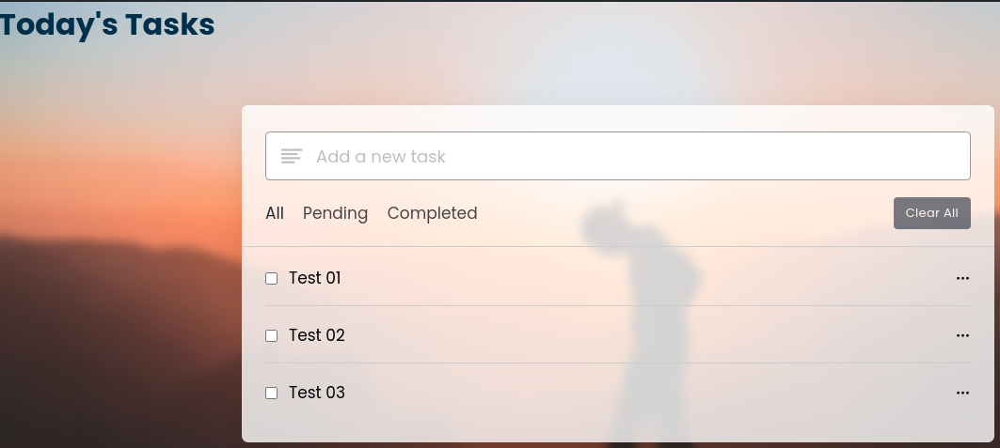

# Basic ToDo App

    

This Basic ToDo App allows users to manage their daily tasks effectively. It features the ability to add, edit, and delete tasks, as well as filter them based on their status (All, Pending, Completed). For now, only utilize local storage to save tasks, ensuring that the user's data persists between sessions.

And it's responsive!!

## Features
- **Add Tasks:** Add a task in the input field and press Enter to add it to the list.
- **Edit Tasks:** Click on the edit option in the task's menu to modify an existing task.
- **Delete Tasks:** Remove a task by clicking on the trash icon in the task's menu.
- **Filter Tasks:** Filter tasks by All, Pending, or Completed status to focus on specific sets of tasks.
- **Data Persistence:** Tasks are saved in local storage, so they remain available even after the browser is closed.
- **Task Selection:** Previously added tasks are suggested in the input field as you type, allowing for easy reuse of similar entries.

_This is a work in progress._
I intend to include creation dates.
And whatever I think it could be interesting.